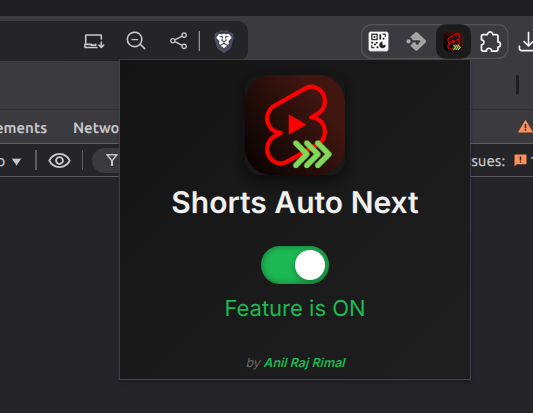

# YouTube Shorts Auto Next

Automatically skip to the next YouTube Short after the current one finishes playing.

> Built by [Anil Raj Rimal](https://anilrajrimal.com.np/)

---

## Features

- ✅ Automatically skip to the next Short when one ends
- ✅ Beautiful, modern, and responsive popup UI
- ✅ Enable/disable the feature easily
- ✅ Saves preference between browser sessions
- ✅ Lightweight and privacy-focused (no data collection)

---

## Installation (Manual)

1. Download or clone this repository.
2. Go to `chrome://extensions/` in your Chrome browser.
3. Enable **Developer Mode** (top right toggle).
4. Click **Load unpacked** → select this folder.
5. Enjoy watching YouTube Shorts with automatic next skips!

---

## Publish on Chrome Web Store

Publishing on the way — soon available at:

```
[Chrome Web Store Link will be here]
```

---

## Screenshots

| Popup UI                           |
|------------------------------------|
|  |

---

## License

MIT License © [Anil Raj Rimal](https://anilrajrimal.com.np/)

---

## ❤️ Support

If you enjoy using this extension or want to collaborate:

- 🌐 [anilrajrimal.com.np](https://anilrajrimal.com.np/)
- ✉️ anilrajrimal@gmail.com

Let's build more together 🚀
